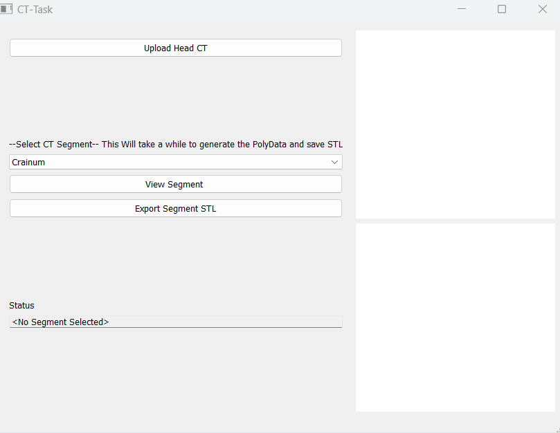
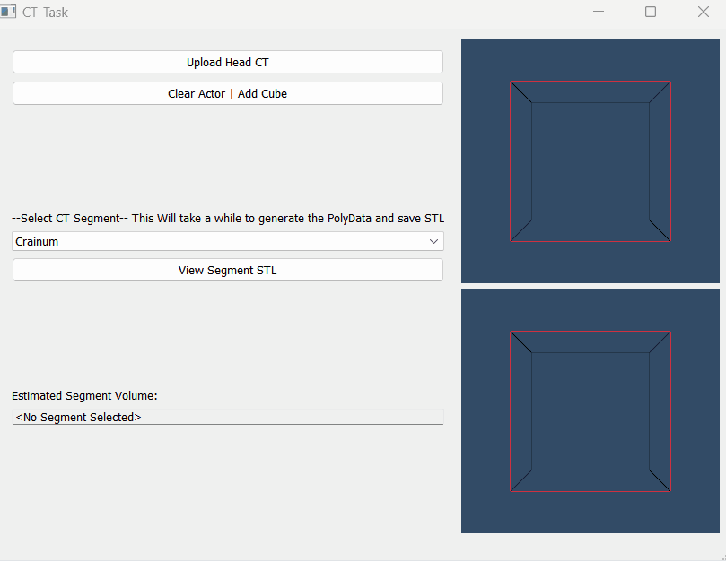
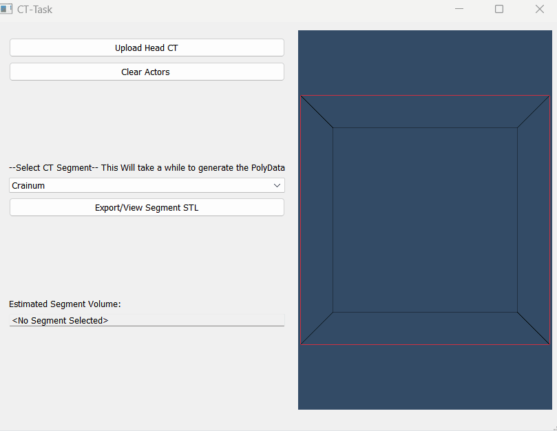
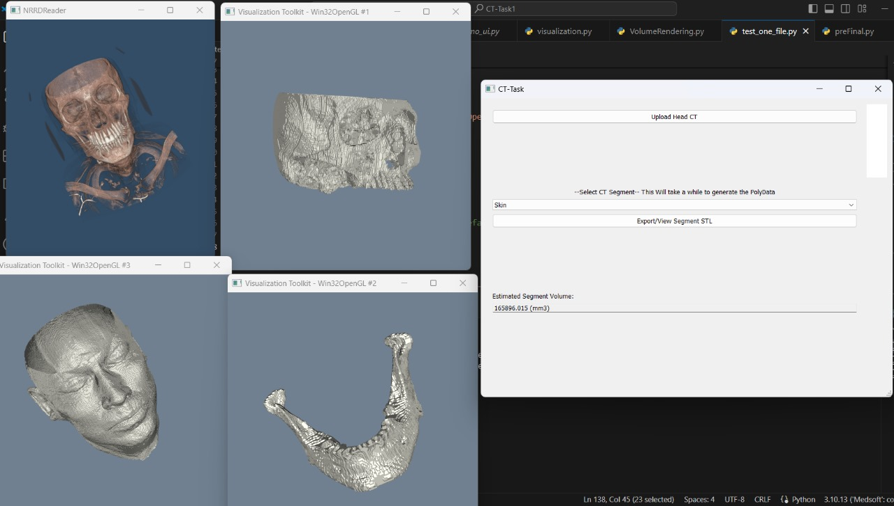

# medsoft_hady_task1

## Update 3 - Separate Export Button | restructure files


## Updates 2 - VTK Render Multiple Windows in GridLayout



## Updates 1 - VTK Render Window in same QT App
New Files 
> `Working_QH/refactor_QH.py` **Run app from Here**
> 
>`Working_QH/Rendering.py`

- render all the scenes inside a H Box
- Clear actors before Re-Render




## First Attempt


- Upload Data NNRD (Perform Volume Rendering)
> File:  HNSCC-01-0080_CT.nrrd 
>
> Main Functions used: colorTransferFunction, volumeScalarOpacity, volumeGradientOpacity


- Choose Segment  
> File:  HNSCC-01-0080_CT_Masks.nrrd 
>
> Main Function Used: sitk.BinaryThreshold

- Calculate the surface volume of each segment 

Use image spacing instead of ShapeStat to reduce the overhead

```python
# Compute the physical size of the binary mask
physical_size = sitk.GetArrayFromImage(binary_mask).sum() * image.GetSpacing()[0] * image.GetSpacing()[1] * image.GetSpacing()[2]
```

> SoftTissue Volme = $165896.015$ $ mm^{3}$
>
>`similar to 3d slicer segmet statistics`

- Export and View STL Segment 
 


## Issues will be resolved soon
| Feature                              | Status      |
|--------------------------------------|-------------|
| Load VTK window within the Qt app    | ✅          |
| Separate and restructure logic       | ✅          |
| Rerender window in Qt loop           | ✅          |
| Refactor                             | ⏳          |
| Sitk conversion file output "compressed"    | ✅          |
| Stl save as binary reduce the size significantly    | ✅          |
