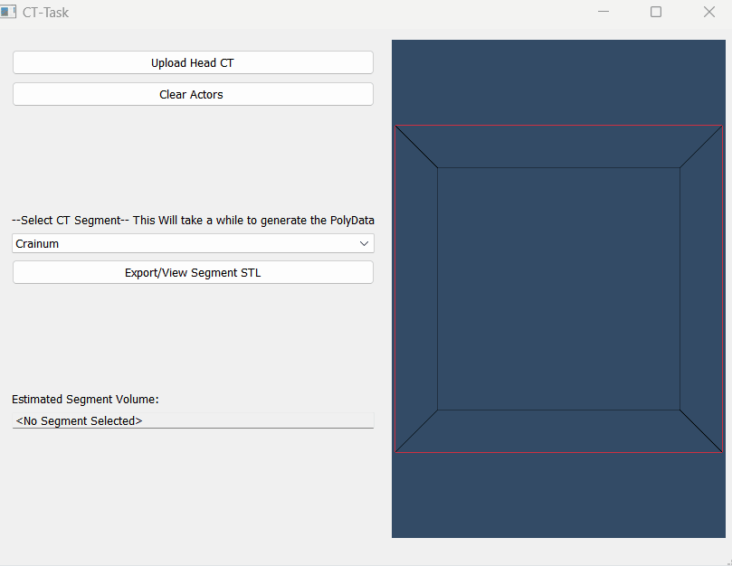
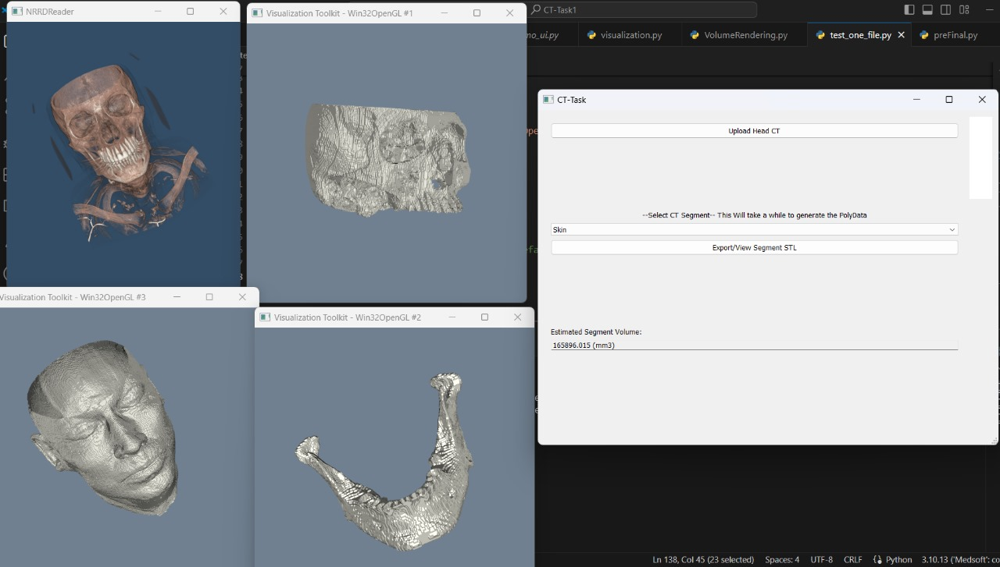

# medsoft_hady_task1


## VTK Render Window in same QT APp
New Files 
> `refactor_v1_QH.py` **Run app from Here**
> 
>`Rendering.py`

- render all the scenes inside a H Box
- Clear actors before Re-Render






- Upload Data NNRD (Perform Volume Rendering)
> File:  HNSCC-01-0080_CT.nrrd 
>
> Main Functions used: colorTransferFunction, volumeScalarOpacity, volumeGradientOpacity


- Choose Segment  
> File:  HNSCC-01-0080_CT_Masks.nrrd 
>
> Main Function Used: sitk.BinaryThreshold

- Calculate the surface volume of each segment 

Use image spacing instead of ShapeStat to reduce the overhead

```python
# Compute the physical size of the binary mask
physical_size = sitk.GetArrayFromImage(binary_mask).sum() * image.GetSpacing()[0] * image.GetSpacing()[1] * image.GetSpacing()[2]
```

> SoftTissue Volme = $165896.015$ $ mm^{3}$
>
>`similar to 3d slicer segmet statistics`

- Export and View STL Segment 
 


## Issues will be resolved soon
- load vtk window within the qt app
- separate and restructure the logic into files for more readability
- Rerender the window in the qt loop instead of instantioating a new one 
- sitk conversion file output "big"   